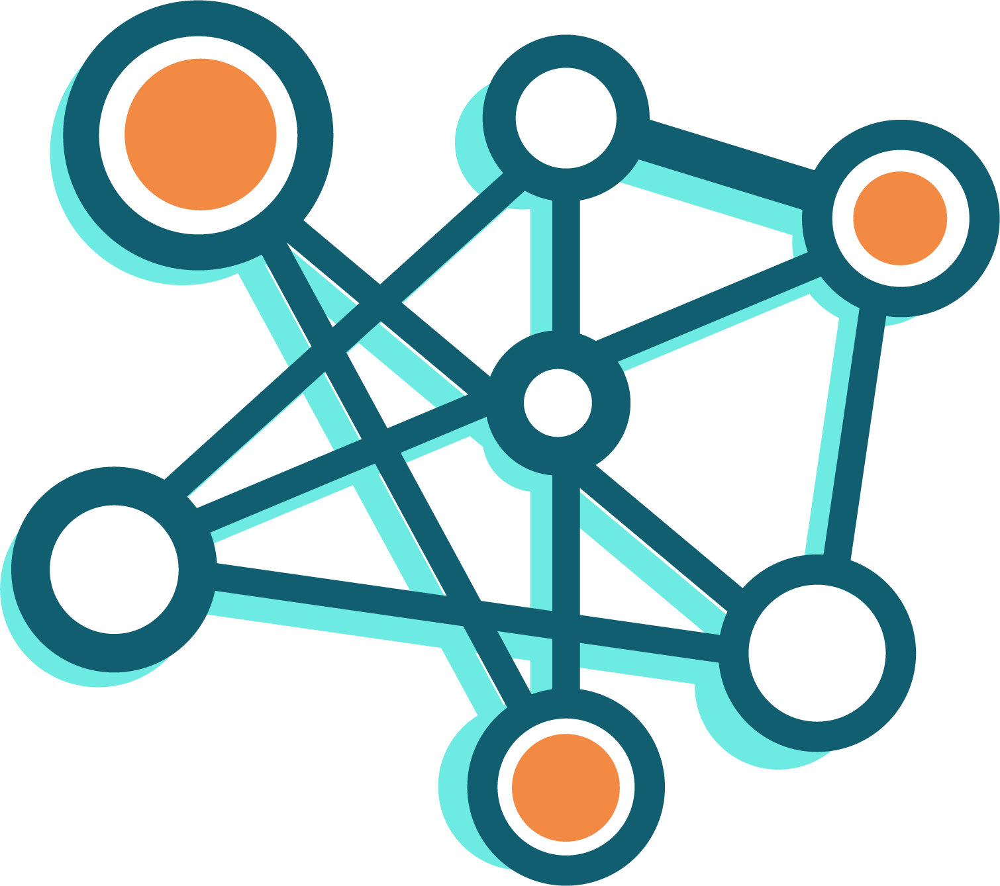

# CTINEXUS

<p align="center">
    <br>
    
    <br>
</p>

**LLM-empowered CTI Information Extraction (IE) and Knowledge Graph Construction (KGC) Framework**

---

## Overview

**CTINEXUS** is a novel framework that leverages in-context learning (ICL) of large language models (LLMs) to perform efficient Cyber Threat Intelligence (CTI) information extraction and construct high-quality cybersecurity knowledge graphs (CSKGs). Unlike traditional methods, CTINEXUS does not require extensive data or parameter tuning and can adapt to various ontologies with minimal annotated examples.

### Key Features

1. **Automatic Prompt Construction Strategy**: Utilizes optimal demonstration retrieval for extracting a wide range of cybersecurity entities and relations.
2. **Hierarchical Entity Alignment Technique**: Canonicalizes extracted knowledge and removes redundancy.
3. **ICL-enhanced Long-distance Relation Prediction**: Completes the CSKG by predicting missing links.

Our extensive evaluations using 150 real-world CTI reports from 10 platforms demonstrate that CTINEXUS significantly outperforms existing methods in constructing accurate and complete CSKGs. This highlights its potential to transform CTI analysis with an efficient and adaptable solution for the dynamic threat landscape.

---

## Components

- **`main.py`**: The entry point for all components and sub-components.
  - We use the `hydra` library for pipeline configuration. Edit configuration parameters in `main.py` to try different settings.
  - **Configuration Locations**:
    - In `main.py`, modify the hydra decorator:
      ```python
      @hydra.main(config_path="config", config_name="your_config", version_base="1.2")
      ```
    - Configuration files are located in the `config` folders under `IE`, `KGC/Tagger`, `KGC/Merger`, and `KGC/Linker`.
      - Different configurations require different files. Specify the desired configuration in `main.py`.

### Information Extraction (IE)

- **Purpose**: Extract triplets according to the applied ontology.
- **Ontology Application**:
  - Modify the prompt file at `Toolbox/IE_Prompts/QD1.jinja` to change the applied ontology.

### Knowledge Graph Construction (KGC)

- **Tagger**: Tags entities with their corresponding types.
- **Merger**: Merges entities of the same type with high semantic similarity.
- **Linker**: Links distantly related entities based on context.

---

## Installation

```bash
# Clone the repository
git clone https://github.com/yourusername/CTINEXUS.git

# Navigate to the project directory
cd CTINEXUS

# Install required dependencies
pip install -r requirements.txt
```

---

## Usage

```bash
# Run the main pipeline with your specified configuration
python main.py --config-name your_config.yaml
```

- Replace `your_config.yaml` with the name of your configuration file.
- Edit configurations as needed in the `config` directories mentioned above.

---

## Evaluation Results

CTINEXUS has been rigorously tested using 150 real-world CTI reports from 10 different platforms. The framework:

- **Outperforms existing methods** in constructing accurate and complete CSKGs.
- **Adapts efficiently** to new threats and ontologies with minimal annotated examples.
- **Reduces redundancy** through hierarchical entity alignment.
- **Enhances knowledge graphs** by predicting and adding missing links.

---

## Example

### Before Correction

```python
# In main.py
@hydra.main(config_path="config", config_name="default", version_base="1.2")
```

### After Modification

```python
# In main.py
@hydra.main(config_path="config", config_name="demoNum=4", version_base="1.2")
```

- **Note**: Change `demoNum=4` to your desired configuration name.

---

## Contributing

We welcome contributions from the community!

- **Issues**: Submit bug reports or feature requests.
- **Pull Requests**: Fork the repository and submit your improvements.

---

## License

This project is licensed under the [MIT License](LICENSE).

---

## Contact

For questions or feedback, please contact [your-email@example.com](mailto:your-email@example.com).

---

**Join us in transforming CTI analysis with CTINEXUS!**
